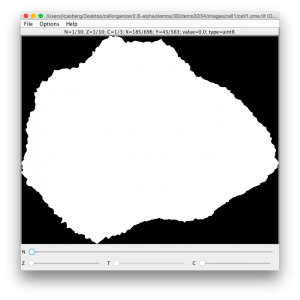

We have added new functionality to CellOrganizer, including the possibility to save synthetic images as OME-TIFF. The header in an OME-TIFF file is an XML snippet that follows the OME data model.We have added new functionality to CellOrganizer, including the possibility to save synthetic images as OME-TIFF. The header in an OME-TIFF file is an XML snippet that follows the [OME data model](http://www.openmicroscopy.org/site/support/ome-model/).

To generate OME-TIFF files in CellOrganizer, make sure that the correct output flag is set to true

```
options.output.OMETIFF = true;
```

## demo3D34



In CellOrganizer, demo3D34 synthesizes an image and saves it as an OME-TIFF.

To validate the OME.tiff we use [Bioformats command line tools](http://www.openmicroscopy.org/site/support/bio-formats5.2/users/comlinetools/), especifically

* **xmlvalid**. A command-line XML validation tool, useful for checking an OME-XML document for compliance with the OME-XML schema.
This tool will validate the XML snippet in the header against the OME data model schema. The XML header attached to this example is

This tool will validate the XML snippet in the header against the OME data model schema. The XML header attached to this example is

```
<?xml version="1.0" encoding="utf-8"?><!-- Warning: this comment is an OME-XML metadata block, which contains crucial dimensional parameters and other important metadata. Please edit cautiously (if at all), and back up the original data before doing so. For more information, see the OME-TIFF web site: http://www.openmicroscopy.org/site/support/ome-model/ome-tiff/. --><OME xmlns="http://www.openmicroscopy.org/Schemas/OME/2016-06" xmlns:xsi="http://www.w3.org/2001/XMLSchema-instance" Creator="OME Bio-Formats 5.2.4" UUID="urn:uuid:49279097-4296-40f5-920b-aa60b3c3850c" xsi:schemaLocation="http://www.openmicroscopy.org/Schemas/OME/2016-06 http://www.openmicroscopy.org/Schemas/OME/2016-06/ome.xsd"><Image ID="Image:0"><Pixels BigEndian="true" DimensionOrder="XYZCT" ID="Pixels:0" PhysicalSizeX="0.049" PhysicalSizeXUnit="µm" PhysicalSizeY="0.049" PhysicalSizeYUnit="µm" PhysicalSizeZ="0.2" PhysicalSizeZUnit="µm" SizeC="3" SizeT="1" SizeX="696" SizeY="563" SizeZ="10" Type="uint8"><Channel ID="Channel:0:0" Name="cell" SamplesPerPixel="1"><LightPath/></Channel><Channel ID="Channel:0:1" Name="nucleus" SamplesPerPixel="1"><LightPath/></Channel><Channel ID="Channel:0:2" Name="vesicle1" SamplesPerPixel="1"><LightPath/></Channel><TiffData FirstC="0" FirstT="0" FirstZ="0" IFD="0" PlaneCount="1"><UUID FileName="cell1.ome.tif">urn:uuid:49279097-4296-40f5-920b-aa60b3c3850c</UUID></TiffData><TiffData FirstC="0" FirstT="0" FirstZ="1" IFD="1" PlaneCount="1"><UUID FileName="cell1.ome.tif">urn:uuid:49279097-4296-40f5-920b-aa60b3c3850c</UUID></TiffData><TiffData FirstC="0" FirstT="0" FirstZ="2" IFD="2" PlaneCount="1"><UUID FileName="cell1.ome.tif">urn:uuid:49279097-4296-40f5-920b-aa60b3c3850c</UUID></TiffData><TiffData FirstC="0" FirstT="0" FirstZ="3" IFD="3" PlaneCount="1"><UUID FileName="cell1.ome.tif">urn:uuid:49279097-4296-40f5-920b-aa60b3c3850c</UUID></TiffData><TiffData FirstC="0" FirstT="0" FirstZ="4" IFD="4" PlaneCount="1"><UUID FileName="cell1.ome.tif">urn:uuid:49279097-4296-40f5-920b-aa60b3c3850c</UUID></TiffData><TiffData FirstC="0" FirstT="0" FirstZ="5" IFD="5" PlaneCount="1"><UUID FileName="cell1.ome.tif">urn:uuid:49279097-4296-40f5-920b-aa60b3c3850c</UUID></TiffData><TiffData FirstC="0" FirstT="0" FirstZ="6" IFD="6" PlaneCount="1"><UUID FileName="cell1.ome.tif">urn:uuid:49279097-4296-40f5-920b-aa60b3c3850c</UUID></TiffData><TiffData FirstC="0" FirstT="0" FirstZ="7" IFD="7" PlaneCount="1"><UUID FileName="cell1.ome.tif">urn:uuid:49279097-4296-40f5-920b-aa60b3c3850c</UUID></TiffData><TiffData FirstC="0" FirstT="0" FirstZ="8" IFD="8" PlaneCount="1"><UUID FileName="cell1.ome.tif">urn:uuid:49279097-4296-40f5-920b-aa60b3c3850c</UUID></TiffData><TiffData FirstC="0" FirstT="0" FirstZ="9" IFD="9" PlaneCount="1"><UUID FileName="cell1.ome.tif">urn:uuid:49279097-4296-40f5-920b-aa60b3c3850c</UUID></TiffData><TiffData FirstC="1" FirstT="0" FirstZ="0" IFD="10" PlaneCount="1"><UUID FileName="cell1.ome.tif">urn:uuid:49279097-4296-40f5-920b-aa60b3c3850c</UUID></TiffData><TiffData FirstC="1" FirstT="0" FirstZ="1" IFD="11" PlaneCount="1"><UUID FileName="cell1.ome.tif">urn:uuid:49279097-4296-40f5-920b-aa60b3c3850c</UUID></TiffData><TiffData FirstC="1" FirstT="0" FirstZ="2" IFD="12" PlaneCount="1"><UUID FileName="cell1.ome.tif">urn:uuid:49279097-4296-40f5-920b-aa60b3c3850c</UUID></TiffData><TiffData FirstC="1" FirstT="0" FirstZ="3" IFD="13" PlaneCount="1"><UUID FileName="cell1.ome.tif">urn:uuid:49279097-4296-40f5-920b-aa60b3c3850c</UUID></TiffData><TiffData FirstC="1" FirstT="0" FirstZ="4" IFD="14" PlaneCount="1"><UUID FileName="cell1.ome.tif">urn:uuid:49279097-4296-40f5-920b-aa60b3c3850c</UUID></TiffData><TiffData FirstC="1" FirstT="0" FirstZ="5" IFD="15" PlaneCount="1"><UUID FileName="cell1.ome.tif">urn:uuid:49279097-4296-40f5-920b-aa60b3c3850c</UUID></TiffData><TiffData FirstC="1" FirstT="0" FirstZ="6" IFD="16" PlaneCount="1"><UUID FileName="cell1.ome.tif">urn:uuid:49279097-4296-40f5-920b-aa60b3c3850c</UUID></TiffData><TiffData FirstC="1" FirstT="0" FirstZ="7" IFD="17" PlaneCount="1"><UUID FileName="cell1.ome.tif">urn:uuid:49279097-4296-40f5-920b-aa60b3c3850c</UUID></TiffData><TiffData FirstC="1" FirstT="0" FirstZ="8" IFD="18" PlaneCount="1"><UUID FileName="cell1.ome.tif">urn:uuid:49279097-4296-40f5-920b-aa60b3c3850c</UUID></TiffData><TiffData FirstC="1" FirstT="0" FirstZ="9" IFD="19" PlaneCount="1"><UUID FileName="cell1.ome.tif">urn:uuid:49279097-4296-40f5-920b-aa60b3c3850c</UUID></TiffData><TiffData FirstC="2" FirstT="0" FirstZ="0" IFD="20" PlaneCount="1"><UUID FileName="cell1.ome.tif">urn:uuid:49279097-4296-40f5-920b-aa60b3c3850c</UUID></TiffData><TiffData FirstC="2" FirstT="0" FirstZ="1" IFD="21" PlaneCount="1"><UUID FileName="cell1.ome.tif">urn:uuid:49279097-4296-40f5-920b-aa60b3c3850c</UUID></TiffData><TiffData FirstC="2" FirstT="0" FirstZ="2" IFD="22" PlaneCount="1"><UUID FileName="cell1.ome.tif">urn:uuid:49279097-4296-40f5-920b-aa60b3c3850c</UUID></TiffData><TiffData FirstC="2" FirstT="0" FirstZ="3" IFD="23" PlaneCount="1"><UUID FileName="cell1.ome.tif">urn:uuid:49279097-4296-40f5-920b-aa60b3c3850c</UUID></TiffData><TiffData FirstC="2" FirstT="0" FirstZ="4" IFD="24" PlaneCount="1"><UUID FileName="cell1.ome.tif">urn:uuid:49279097-4296-40f5-920b-aa60b3c3850c</UUID></TiffData><TiffData FirstC="2" FirstT="0" FirstZ="5" IFD="25" PlaneCount="1"><UUID FileName="cell1.ome.tif">urn:uuid:49279097-4296-40f5-920b-aa60b3c3850c</UUID></TiffData><TiffData FirstC="2" FirstT="0" FirstZ="6" IFD="26" PlaneCount="1"><UUID FileName="cell1.ome.tif">urn:uuid:49279097-4296-40f5-920b-aa60b3c3850c</UUID></TiffData><TiffData FirstC="2" FirstT="0" FirstZ="7" IFD="27" PlaneCount="1"><UUID FileName="cell1.ome.tif">urn:uuid:49279097-4296-40f5-920b-aa60b3c3850c</UUID></TiffData><TiffData FirstC="2" FirstT="0" FirstZ="8" IFD="28" PlaneCount="1"><UUID FileName="cell1.ome.tif">urn:uuid:49279097-4296-40f5-920b-aa60b3c3850c</UUID></TiffData><TiffData FirstC="2" FirstT="0" FirstZ="9" IFD="29" PlaneCount="1"><UUID FileName="cell1.ome.tif">urn:uuid:49279097-4296-40f5-920b-aa60b3c3850c</UUID></TiffData></Pixels></Image></OME>
```

Running xmlvalid against the OME-TIFF file

```
./xmlvalid cell1.ome.tif
Parsing schema path
http://www.openmicroscopy.org/Schemas/OME/2016-06/ome.xsd
Validating cell1.ome.tif
No validation errors found.
```
