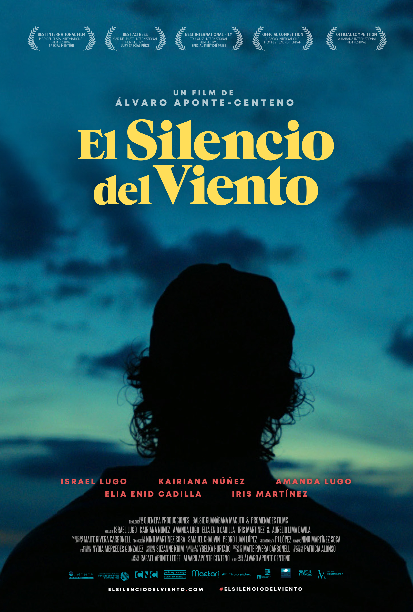

Filmmaker/Director: Alvaro Aponte 
Runtime: 1h 44m 
Screening Date: Tuesday, April 07, 2020 
Screening Location: 203 Frick Fine Arts 

Gloria's parents are revolutionary Sandinistas, fighting to liberate Nicaragua from dictatorship. In 1979, they finally succeed, plunging the nation into civil war. Living life on the front line, the greater good forever takes centre stage. But what about young Gloria? Now an adult, her reflections pave the way for searing debates regarding torture, tragedy and the importance of parental love.
