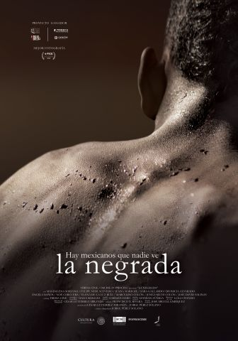

Jorge Perez Solano 
Runtime: 1h 44m 
Screening Date: Thursday, March 19, 2020 
Screening Location: 203 Frick Fine Arts 

Among the black population of the Oaxaca coast, Juana and Magdalena share their life with Neri although they know that it hurts them. N addition, Juana’s terminal disease will give Magdalena clarity to resume her life.
