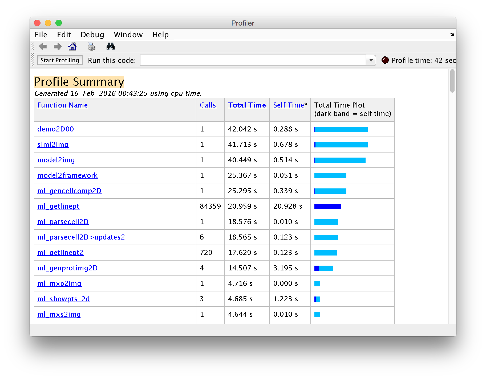
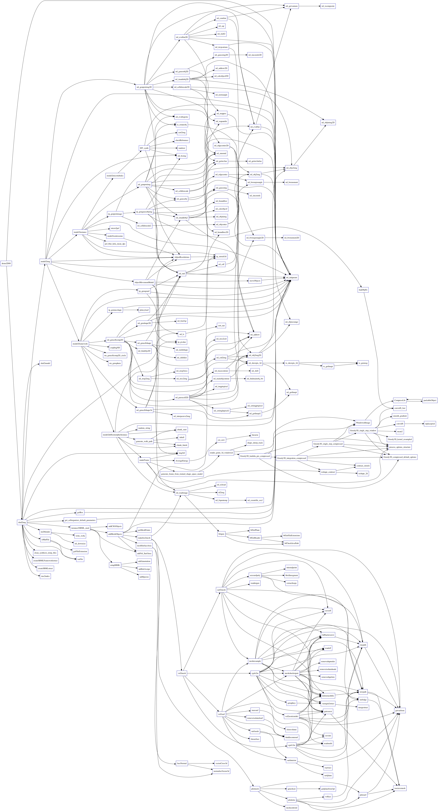

You can use Matlab’s profile function to get some useful information about your scripts.

For example, running the profiler around CellOrganizer’s demo2D00

```
>> profile on; 
>> demo2D00(); 
>> profile off; 
>> profview
```

will produce a report similar to this one



Report from running a profile on demo2D00.

But sometimes you want something visual. And…. here comes [GraphViz-like tools for MATLAB](http://www.mathworks.com/matlabcentral/fileexchange/27608-graphviz-like-tools-for-matlab) to the rescue!

GraphViz-like tools for Matlab “[…] creates a GraphViz dot language representation of the dependencies of a function.”

Using this tool is very straightforward, all you need to do is download the toolkit along with its dependencies; [fdep: a pedestrian function dependencies finder](http://www.mathworks.com/matlabcentral/fileexchange/17291-fdep--a-pedestrian-function-dependencies-finder) and [GraphViz](http://www.graphviz.org/).

## Installation

Before we start you need

* [Matlab](http://www.mathworks.com/)
* [Homebrew](http://brew.sh/)

I tested the toolkit in Matlab 2014b for Mac.  This shell script will download the toolkit and its two dependencies. Assuming you are using HomeBrew, it is will also install GraphViz

```
wget -nc http://www.mathworks.com/matlabcentral/mlc-downloads/downloads/submissions/27608/versions/2/download/zip/docsgen_dot_tools.zip
unzip -o docsgen_dot_tools.zip
rm -f docsgen_dot_tools.zip
wget -nc http://www.mathworks.com/matlabcentral/mlc-downloads/downloads/submissions/24652/versions/4/download/zip/drawDot.zip
unzip -o drawDot.zip
rm -f drawDot.zip
wget -nc http://www.mathworks.com/matlabcentral/mlc-downloads/downloads/submissions/17291/versions/8/download/zip/fdep_21jun2010.zip
unzip -o fdep_21jun2010.zip
rm -f fdep_21jun2010.zip
brew install graphviz
```

If the above commands were successful, then you should see the following files as well as the dot binary.

```
$ ls
drawDot.m  hfdep    mGraphViz.m  script.sh  tfdep2.m  tfdep4.m
fdep.m    license.txt  mkdotfile.m  tfdep1.m  tfdep3.m
$ which dot
/usr/local/bin/dot
```

## Example

This example makes the graph from a file in my desktop. Make sure the file save in the variable ifile exists before running.

```
echo "
ifile = '~/Desktop/script.m';
if exist( ifile )
  ofile = 'graph.dot';
  txt = mkdotfile( ifile, ofile );
  system( [dot -Tjpg graph.dot -o graph.jpg] );
  exit;" > make_graph.m
end
matlab -nodesktop -nosplash -r "make_dot_graph;"
```

The result from running the script above is the graph below



Result from running GraphViz-like tools for MATLAB on CellOrganizer’s demo2D00.
