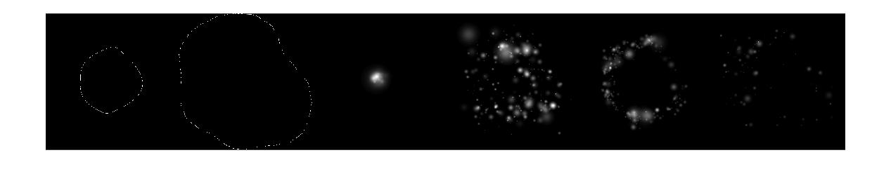
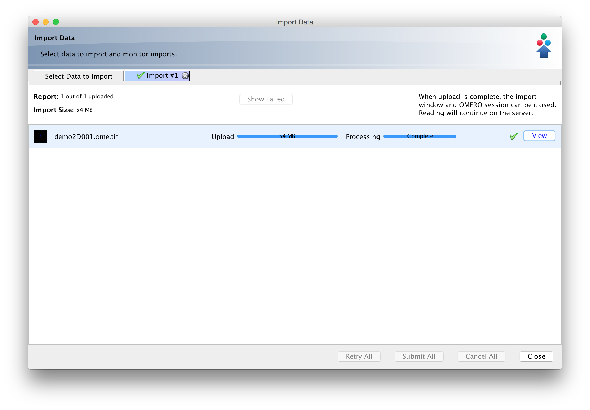
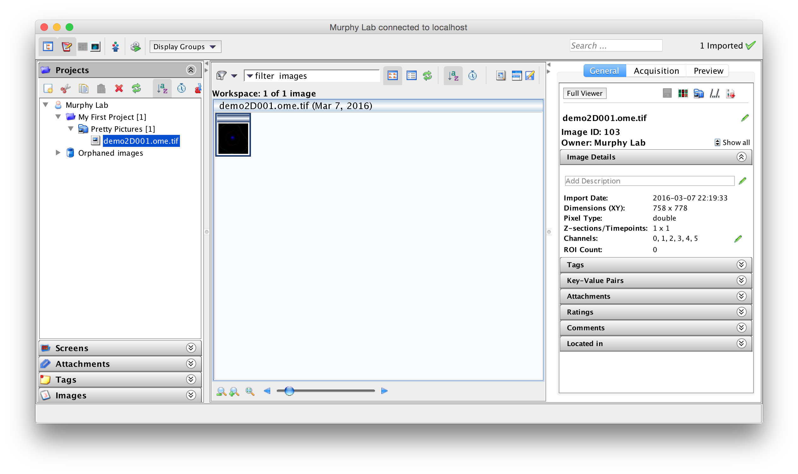
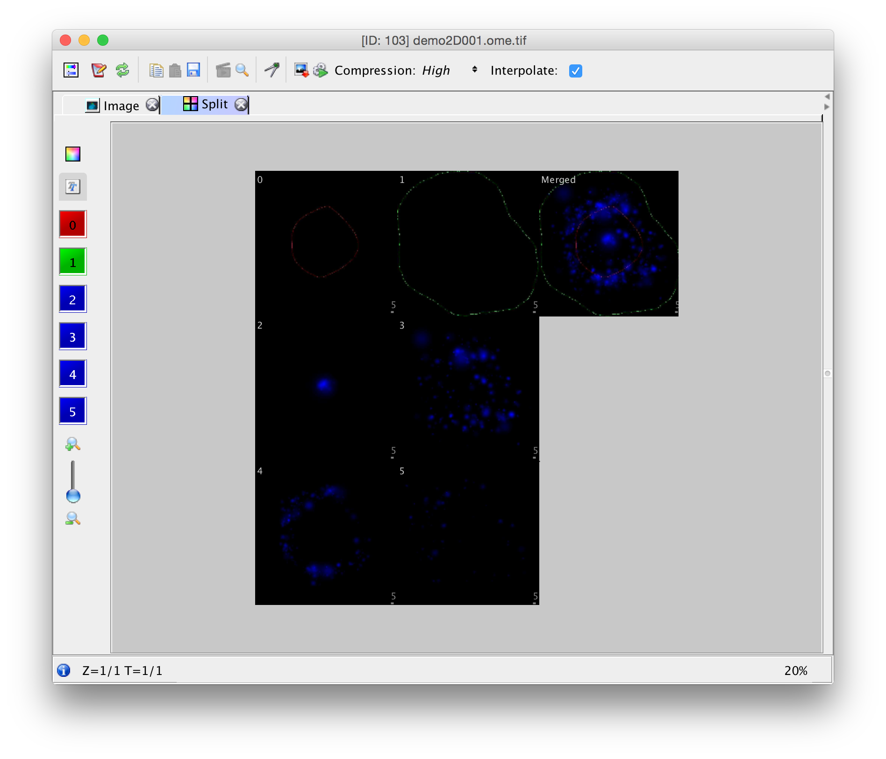

For this example I am using the image generated by CellOrganizer’s demo2D00.

```
>> help demo2D00
 demo2D00
 
 Synthesize one 2D image from all object models. Results will be one TIFF file, with six slices, one each for cell boundary, nuclear boundary, nucleoli, mitochondria, lysosomes, and endosomes.
```

which generate one multitiff file

```
>> setup;
demo2D00()
Checking for new stable version. Version is up to date.
Checking existence of log folder
Making log directory /Users/icaoberg/Desktop/cellorganizer/demos/2D/demo2D00/log
Checking the validity of input files
Parsing SLML instances
Checking existence of temporary folder
Creating temporary folder in: /Users/icaoberg/Desktop/cellorganizer/demos/2D/demo2D00/temp
Setting target directory to: /Users/icaoberg/Desktop/cellorganizer/demos/2D/demo2D00/images
Setting prefix to: demo2D00_
Setting number of synthesized images to: 1
Setting compression to: lzw
Synthesizing image 1. Please wait, this might take several minutes.
Setting model dimensionality to 2D
Checking all models have the same dimensionality
Generating cell shape
Removing temporary files
Closing log file.
Finished synthesis
Elapsed time is 16.146033 seconds.
```

The generated image is

```
>> img = tif2img( 'demo2D001.tif' );
>> whos img
  Name        Size                  Bytes  Class     Attributes
  img       778x758x6            28306752  double
>> imshow( reshape( img, size(img,1),[] ) )
```



## Intro to Bio-Formats


The important thing to keep in mind is that the pixel data in an OMERO image is essentially a 5D array, where the information is stored as xyzct.

Since we are not saving any metadata in the OME.tiff, we can save the pixel data in three steps

* Read the original synthetic image generated from CellOrganizer
* Reshape the pixel data to a 5D array
* Save the pixel data using BioFormats

### Reading and saving the data as an OME.tiff

```
img = tif2img( 'demo2D001.tif' );
addpath( './bfmatlab' );
omeimg = [];
for i=1:1:size(img,3)
    %remember the indices mean xyzct
    omeimg(:,:,1,i,1) = img(:,:,i);
end
bfsave( omeimg, 'demo2D001.ome.tif' );
```

The above snippet generates a valid OME.tiff. You can then use OMERO.importer to import the image to the server


Once the image has been imported, you should be able to use OMERO.insight to see it


You can double click on the image thumbnail to open the full viewer


Notice the six colored buttons to the right. Those represent the different channels. At the bottom of the screen you can also notice the string “Z=1/1, T=1/1”. This means we successfully made and imported a single time point 2D image with 6 channels.
