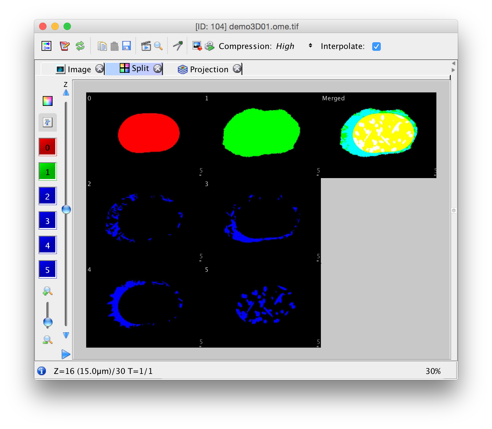

In the previous example we used a 2D multitiff to make an OME.tiff.  In this example we are going to use the files generated by demo3D01.

In this script we are loading each file, one by one, and then we are concatenating them.

```
files = { 'nucleus.tif', 'cell.tif', 'lysosome.tif', 'endosome.tif', ...
    'mitochondrion.tif', 'nucleoli.tif' };
addpath( './bfmatlab' );
omeimg = [];
for c=1:1:numel(files)
    file = files{c};
    img = tif2img( file );
    for z=1:1:size(img,3)
        %remember the indices mean xyzct
        omeimg(:,:,z,c,1) = img(:,:,z);
    end
end
bfsave( omeimg, 'demo3D01.ome.tif', 'Compression', 'LZW' );
```

You can probably optimize the snippet. We want to use the compression option to make a smaller file. Using compression you get

```
$ du -h demo3D01.ome.tif
 14M  demo3D01.ome.tif
```

Without compression

```
$ du -h demo3D01.ome.tif
423M  demo3D01.ome.tif
```

Like the previous example, then you can import the image to the server


