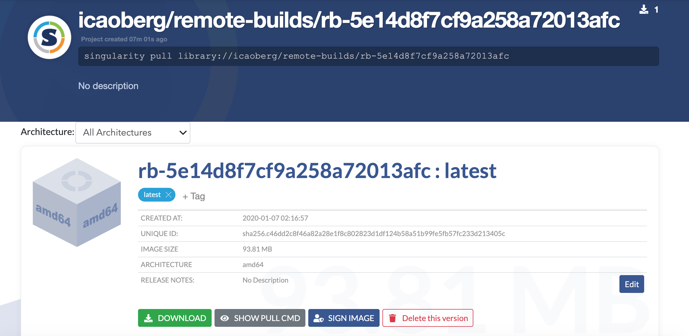

[gotop](https://github.com/cjbassi/gotop) is a very useful app that I use all the time in our department cluster. Even though I have root privileges in our HPC cluster, I'd rather do my computing as a regular user. It keeps me in check and forces me to think like a power/regular user.

Hence, I use [gotop](https://github.com/cjbassi/gotop) in a Singularity container.  

## Source code
You can find the recipe to build the container [here](https://github.com/icaoberg/singularity-gotop).

To facilitate building the container, you will find two **simple** scripts in the repository

* `rbuild.sh`. Builds the image remotely and then pulls it down locally. You will need access to [SyLabs.io Remote Builder](https://cloud.sylabs.io/builder) to do this. Getting access to the Remote Builder is beyond the scope of this post.
* `build.sh`. Builds the image locally. You will need root privileges to build the container locally.

### Building the image locally

The script `build.sh` looks like

```
#!/bin/bash

IMAGE=singularity-gotop.simg
DEFINITION=Singularity

if [ -f $IMAGE ]; then
	rm -fv $IMAGE
fi

sudo singularity build $IMAGE $DEFINITION
```

To build the image locally simply run

```
bash ./build.sh
```

The output should look similar to

[](https://asciinema.org/a/292285)

### Building the image remotely

The script `rbuild.sh` looks like

```
#!/bin/bash

IMAGE=singularity-gotop.simg
DEFINITION=Singularity

if [ -f $IMAGE ]; then
	rm -fv $IMAGE
fi

singularity build --remote $IMAGE $DEFINITION
```

If you notice, there isn't much difference between this script and the previous script.

To build the image remotely simply run

```
bash ./rbuild.sh
```

The output should look similar to

[](https://asciinema.org/a/cttCPrVN082jOCFdAUyOi0RsB)

A note on building remotely. Because my script is simple and straightforward, there are no annotations associated with this build. If you were to take a look at my profile in [SyLabs.io](https://cloud.sylabs.io/library/icaoberg) you will notice there is a new project associated with the remote build



This is a footprint, evidence the image was built remotely. Also notice the download number is 1. This is because running the remote commands builds the container then downloads it locally.

## Running gotop

To run the app in the container, simply run

```
singularity exec singularity-gotop.simg gotop
```

The output should look similar to

[](https://asciinema.org/a/292294)
