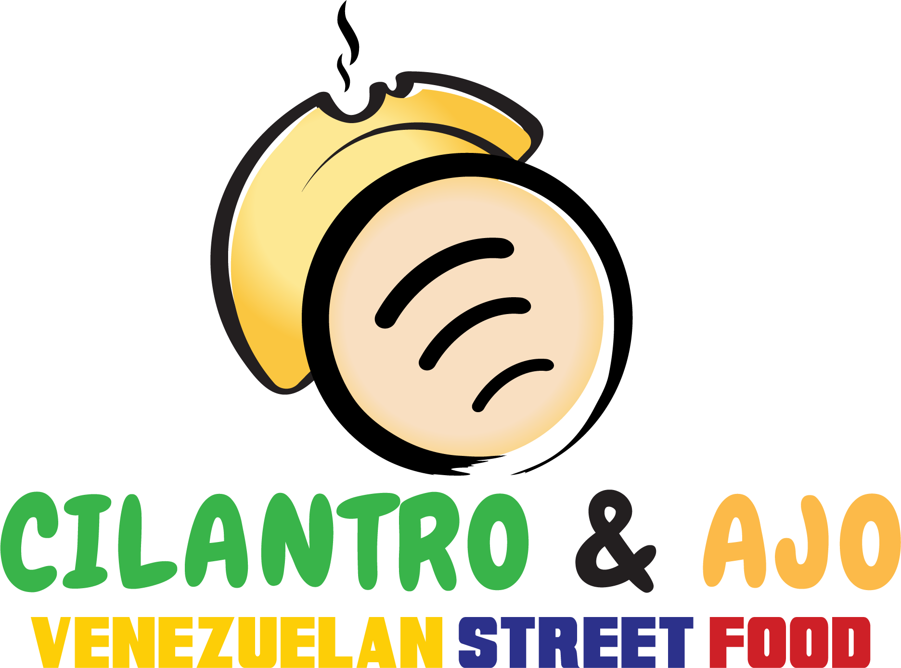

THIS EVENT IS FOR BEGINNERS-INTERMEDIATE SPANISH SPEAKERS

Hi! As some of you know, I am leading Spanish II in Carnegie Library of Pittsburgh. With some of the current members of the group, we will go to Cilantro y Ajo and order some good food.

The catch? You need to order in Spanish! Speaking Spanish is not mandatory for eating but it is for ordering.

Are you up for the challenge?

You can find the menu [here](https://www.yelp.com/biz_photos/cilantro-and-ajo-pittsburgh?tab=menu)
