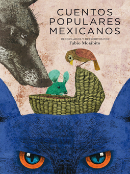

## Book of the Week

Click the image to see the entry on the database.

Remember you can [search the CLP database](https://www.carnegielibrary.org/) for other resources.

### Summary

No summary available on database.
