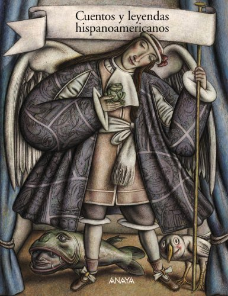

## Book of the Week

Click the image to see the entry on the database.

Remember you can [search the CLP database](https://www.carnegielibrary.org/) for other resources.

### Summary

Selección de sesenta cuentos pertenecientes a la más auténtica tradición oral de numerosos países latinoamericanos. La mayoría de ellos son prácticamente desconocidos por el público lector del continente, pues han sido extraídos de textos de antropólogos y de selecciones muy poco conocidas. Se trata de una colección única, pues en ella se verá representada la experiencia creativa de autores provenientes de dieciocho países. Los relatos se han organizado en cuatro apartados temáticos: Cuentos de pícaros, bobos y listos (humor), Cuentos de cuando los animales hablaban (didácticos), Cuentos de la maravilla (fantasía) y Cuentos sobre el porqué y el origen de las cosas (mitos). Recomendable para compartir en familia. Ideal para que nuestros hijos renueven los vínculos ancestrales que debieran tener con América Latina.
