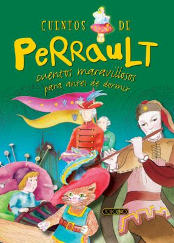

## Book of the Week

Click the image to see the entry on the database.

Remember you can [search the CLP database](https://www.carnegielibrary.org/) for other resources.

### Summary

Tan perfectas para la hora de dormir como cualquier otra hora del día, estas recopilaciones contienen algunos de los más reconocidos y queridos cuentos para niños y de hadas. 

Las ilustraciones vibrantes también hacen favoritos de cuentos menos-conocidos. Algunos de los cuentos incluidos en esta colección son *El gato con botas*, *Rapunzel*, y *Cenicenita*.
