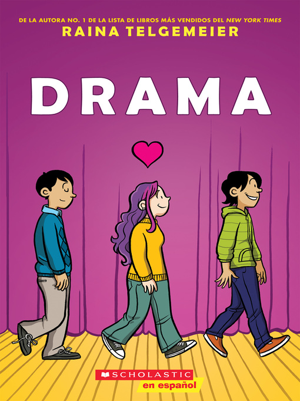

## Book of the Week

Click the image to see the entry on the database.

Remember you can [search the CLP database](https://www.carnegielibrary.org/) for other resources.

### Summary 

A middle-school graphic novel in Spanish! Callie loves theater. And while she would totally try out for her middle school's production of Moon over Mississippi, she can't really sing. Instead she's the set designer for the drama department's stage crew, and this year she's determined to create a set worthy of Broadway on a middle-school budget. 
