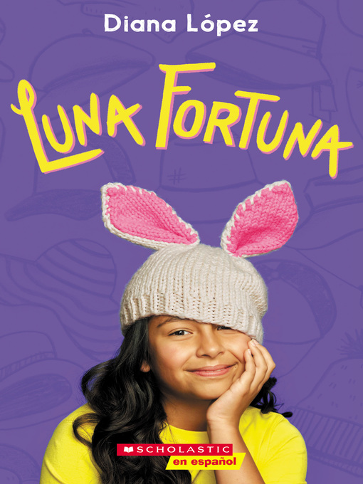

## Book of the Week

Click the image to see the entry on the database.

Remember you can [search the CLP database](https://www.carnegielibrary.org/) for other resources.

### Summary

Enter an enchanted world of kings and giants, where cockroaches play dress-up and coyotes fly to the moon! In this lively bilingual collection of short stories, Spain and Latin America's most beloved tales are retold for a new generation.

From the grateful rooster who cries "Cock-a-doodle-doo!" to the awesome spirit of the Mother of the Jungle, Once Upon a Time/Habia una vez celebrates seven traditional folktales and tells them in a colorful, fresh voice. In these magical adventures that are sure to delight, readers young and old will meet some of the world's most memorable heroes and charming tricksters.
