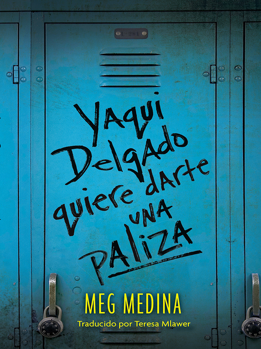

## Book of the Week

Click the image to see the entry on the database.

Remember you can [search the CLP database](https://www.carnegielibrary.org/) for other resources.

### Summary

In Meg Medina's compelling novel, a Latina teen is targeted by a bully at her new school-and must discover resources she never knew she had.

Una mañana antes de ir a clase, una chica le dice a Piddy Sánchez que Yaqui Delgado quiere darle una paliza. Piddy ni siquiera sabe quién es Yaqui, y mucho menos qué es lo que ha hecho para hacerla enfadar. Se dice que Yaqui piensa que Piddy es vanidosa, que se menea al caminar y que no es lo suficiente latina dada su piel blanca, sus buenas calificaciones y su falta de acento. Y Yaqui no bromea, así que mejor que Piddy se cuide su espalda. En un principio, Piddy está más preocupada por saber más sobre su padre al que nunca conoció y cómo equilibrar los cursos de honores y su trabajo de fin de semana en el salón de belleza de su barrio. Pero, a medida que el hostigamiento aumenta, el hecho de evitar a Yaqui y a su grupo empieza a ganar terreno y a ocupar un lugar importante en la vida de Piddy. ¿Existe alguna forma de que Piddy sobreviva sin aislarse o sin escapar? En esta novela fuertemente realista, Meg Medina retrata a una heroína solidaria que es forzada a decidir quién es verdaderamente...
