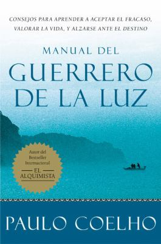

## Music

<iframe width="560" height="315" src="https://www.youtube.com/embed/uldstTKAytg" frameborder="0" allow="accelerometer; autoplay; encrypted-media; gyroscope; picture-in-picture" allowfullscreen></iframe>

Click [here](https://docs.google.com/document/d/1wmPv6Ef8GnmMARFd0L03Ckkwm623nzmKtNy6jJiVIDo/edit?usp=sharing) to see a copy of the document we used today.

Click [here](https://tinycards.duolingo.com/decks/NWCaMoSH/morat-acuerdate-de-mi) for the TinyCards set for this song.

## Exercises

All comments below are based as my experience as an interpreter and are not set in stone. These are based on what was discussed in the experience today.

### Verbs

Comments about *verbs* will be shown in this section.

### Translation

Comments about *translations* will be shown in this section.

### Lyrics

Comments about *lyrics* will be shown in this section.

## Books

The book of the week is *Manual del Guerrero de la Luz*. Click the image to see the entry on the database.

Remember you can [search the CLP database](https://www.carnegielibrary.org/) for other resources.

## Resources
With your Library card, you have access to language learning systems for all ages and stages of fluency—available anywhere, at any time.

Remember there are many resources you can use to learn or practice Spanish.

* [Duolingo](http://www.duolingo.com)
* [Mango Languages](https://connect.mangolanguages.com/einetwork/login?u=617768)
* [Little Pim](http://connect.mangolanguages.com/einetwork/start?target=little_pim)
* [Libby by OverDrive](https://meet.libbyapp.com/)
* [Hoopla](http://www.hoopladigital.com)

## More information
* Click [here](https://tiny.cards/users/iecaoberg) to see a full list of songs available on TinyCards.
* Click [here](https://play.google.com/music/playlist/AMaBXylPqViNePkuApJYuY_5O_dIhdr6xj-OeoahENiB7xjKR2c3h1R3LFbcO4Ya43Y_JdeCwB086YJQ_ptzt3caSN3Hi1TUhQ%3D%3D) for a playlist with songs we are going to listen this Fall.
* Click [here](https://docs.google.com/document/d/1j2lHjCQ9QDb2o-SDTODL9Ojgi09zzi789BctPOw9Z6Q/edit?usp=sharing) to see a list of local resources for learning Spanish.
