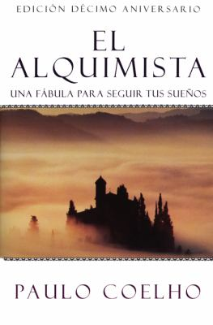

<iframe width="560" height="315" src="https://www.youtube.com/embed/jucBuAzuZ0Eo" frameborder="0" allow="accelerometer; autoplay; encrypted-media; gyroscope; picture-in-picture" allowfullscreen></iframe>

Click [here](https://docs.google.com/document/d/1cx_9QDkoRSXdOjWUQdc_GxN9G92Y-m84JdxnTWqyN40/edit?usp=sharing) to see a copy of the document we used today.

Click [here](https://tinycards.duolingo.com/decks/MYeAMjgc/ale-sanz-ft-marc-anthony-deja-que-te-bese) for the TinyCards set for this song.

## Vocabulary

Here are some important words in the song

| **Spanish**     | **English** | **Comment**                                                    |
|-----------------|-----------|------------------------------------------------------------|
| perfiles        | profiles  |                                                            |
| incendiar       | to ignite |                                                            |
| viento          | wind      |                                                            |

## Books

The book of the week is *El Alquimista*. Click the image to see the entry on the database.

Remember you can [search the CLP database](https://www.carnegielibrary.org/) for other resources.

If you are willing to invest in a book, I personally recommend this workbook.

## Resources
With your Library card, you have access to language learning systems for all ages and stages of fluency—available anywhere, at any time.

Remember there are many resources you can use to learn or practice Spanish.

* [Duolingo](http://www.duolingo.com)
* [Mango Languages](https://connect.mangolanguages.com/einetwork/login?u=617768)
* [Little Pim](http://connect.mangolanguages.com/einetwork/start?target=little_pim)
* [Libby by OverDrive](https://meet.libbyapp.com/)
* [Hoopla](http://www.hoopladigital.com)

## More information
* Click [here](https://docs.google.com/document/d/17eOTapw18BuP5Zvd1ZECif5zDMUsvxT7PsPiSwC7S0o/edit?usp=sharing) to see a full list of songs available on TinyCards.
* Click [here](https://play.google.com/music/playlist/AMaBXylPqViNePkuApJYuY_5O_dIhdr6xj-OeoahENiB7xjKR2c3h1R3LFbcO4Ya43Y_JdeCwB086YJQ_ptzt3caSN3Hi1TUhQ%3D%3D) for a playlist with songs we are going to listen this Fall.
* Click [here](https://docs.google.com/document/d/1j2lHjCQ9QDb2o-SDTODL9Ojgi09zzi789BctPOw9Z6Q/edit?usp=sharing) to see a list of local resources for learning Spanish.
